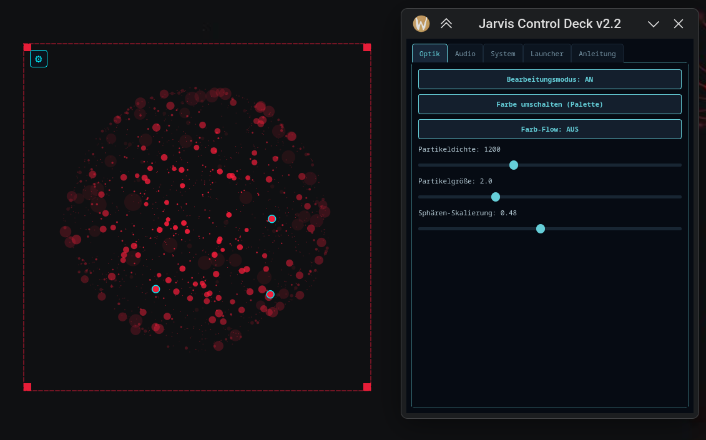

[🇩🇪 Zur deutschen Dokumentation wechseln](README_DE.md) | [🇬🇧 Switch to English Documentation](README.md)

# 🌐 Jarvis Spatial Command Shell (v2.2)

<p align="center">
  
</p>

<p align="center">
  <a href="https://github.com/Graba92/kde-plasma6-3d-particle-launcher"></a>
  
  
  
  
  
  <a href="LICENSE"></a>
</p>

<p align="center">
  <b>🎬 <a href="demo.mp4">Demo-Video ansehen (MP4)</a></b>
</p>

> Die **Jarvis Spatial Command Shell** ist ein hardwarebeschleunigtes, transparentes **3D-Partikel-Hologramm** und ein **Spatial Desktop Launcher** für Linux. Entwickelt für **CachyOS / Arch Linux, Fedora, Ubuntu/Debian** unter **KDE Plasma 6 (Wayland & X11)**.
>
> Sie visualisiert PipeWire-Audio in Echtzeit (Wellen-Ripples, Equalizer-Spikes, Pulse) sowie System-Telemetrie (CPU/RAM) und bietet ein 3D-Kugelmenü mit 4 programmierbaren Direktstart-Slots.

---

## 📑 Inhaltsverzeichnis
1. [Kernfunktionen](#-kernfunktionen)
2. [Steuerung & Tastenkürzel](#-steuerung--tastenkürzel)
3. [Architektur & Dateistruktur](#-architektur--dateistruktur)
4. [Installation & Schnellstart](#-installation--schnellstart)
5. [Konfiguration (Control Deck)](#-konfiguration-control-deck)
6. [Deinstallation](#-deinstallation)
7. [Lizenz](#-lizenz)

---

## ✨ Kernfunktionen

* **100 % Transparent & Desktop-Verankert:** Verbleibt dauerhaft auf dem Wallpaper (`KeepBelow`), taucht nicht in Alt-Tab oder Taskleisten auf.
* **Spatial 4-Slot Launcher:** 1 zentraler Home-Core (`~`) + 3 frei belegbare Schnellstart-Slots für Ordner oder Systemwerkzeuge.
* **Hover Proximity Slowdown:** Nähert sich der Mauszeiger einem Knoten, bremst die Rotation automatisch sanft auf 15 % ab.
* **Holografischer Sub-Bubble Ring:** Schwebt der Cursor über einem Knoten, steigen 4 rotierende Sub-Orbit-Blasen mit Vektordrähten auf.
* **Sci-Fi HUD:** Projektion von gestochen scharfen Vektorlinien mit Zielpfad, Typ und Status bei Mouseover.
* **Echtzeit-PipeWire-FFT:** Direkter Zugriff auf den Monitor-Sink deiner aktiven Soundkarte (HDMI, Klinke, DAC) ohne ALSA/PulseAudio-Latenz.
* **Entkoppeltes Control Deck (5 Tabs):** Einstellungsfenster dockt mit Abstand über/neben der Kugel an – kein Verdecken des Renderings beim Konfigurieren.

---

## 🎮 Steuerung & Tastenkürzel

| Taste / Aktion | Funktion |
| :--- | :--- |
| **`E`** | Schaltet den Bearbeitungsrahmen und das Einstellungs-Zahnrad (⚙) AN oder AUS |
| **`C`** | Öffnet / Schließt das Control Deck jederzeit |
| **Leertaste** / Doppelklick | **Snap-to-Front:** Dreht die Kugel frontal zu den Slots aus |
| **Linksklick + Ziehen** | *(Rahmen AUS)*: Kugel frei im 3D-Raum drehen (Trackball) |
| **Mausrad** | Stufenloser 3D-Zoom der Kugel |
| **Klick auf Knoten** | Öffnet Ordner via `xdg-open` oder führt hinterlegtes Tool aus |
| **`Ctrl` + `Shift` + `J`** | Globaler System-Shortcut zum Starten / Umschalten |
| **Terminal: `jarvis-orb`** | Startet oder toggelt die Shell unabhängig vom Terminal |

---

## 🏛️ Architektur & Dateistruktur

```text
jarvis-spatial-shell/
├── jarvis_core.py              # Master PyQt6 3D-Engine, Math3D, PipeWire-FFT & Control Deck
├── install.sh                  # Universeller Installer (Arch/CachyOS, Fedora, Debian/Ubuntu, openSUSE)
├── uninstall.sh                # Sauberer Deinstaller
├── preview.png                 # Hochauflösendes Vorschau-HUD
├── demo.gif                    # Animierte Vorschau
├── demo.mp4                    # HD-Videodemo
├── LICENSE                     # MIT Lizenz
├── README.md                   # Englische Dokumentation
└── README_DE.md                # Deutsche Dokumentation (diese Datei)
```

---

## 🚀 Installation & Schnellstart

### 1. Automatischer Installer (Empfohlen)

Führe einfach das mitgelieferte Installationsskript aus. Es erkennt automatisch dein Linux-System, installiert alle nötigen Abhängigkeiten und verlinkt das Binary systemweit:

```bash
git clone https://github.com/Graba92/kde-plasma6-3d-particle-launcher.git
cd kde-plasma6-3d-particle-launcher
chmod +x install.sh
./install.sh
```

### 2. Manuelle Installation & Abhängigkeiten

**Für CachyOS / Arch Linux:**
```bash
sudo pacman -S --needed python python-pyqt6 python-psutil pipewire wireplumber
python jarvis_core.py
```

**Für Fedora:**
```bash
sudo dnf install -y python3 python3-pyqt6 python3-psutil pipewire pulseaudio-utils
python3 jarvis_core.py
```

**Für Ubuntu / Debian:**
```bash
sudo apt update && sudo apt install -y python3 python3-pyqt6 python3-psutil pipewire
python3 jarvis_core.py
```

---

## ⚙️ Konfiguration (Control Deck)

Drücke im laufenden Betrieb **`C`** oder klicke auf das Zahnrad (**⚙**), um das **Control Deck** zu öffnen:

1. **Allgemein (General):** Kugelgröße, Partikeldichte, Rotationsgeschwindigkeit, Snap-Winkel.
2. **Audio-FFT:** PipeWire-Empfindlichkeit, Frequenzbänder, Waveform-Ripples und Glow-Effekt.
3. **Slots & Shortcuts:** Frei belegbare Zielpfade für Core- und Sub-Slots (Dateimanager, Terminal, Browser, Custom Scripts).
4. **Telemetrie:** CPU- und RAM-Update-Intervalle, Sci-Fi-HUD-Transparenz.
5. **Autostart:** Ein-Klick-Aktivierung des systemd-User-Services für automatischen Start bei der Plasma-Anmeldung.

---

## 🗑️ Deinstallation

Um die Shell sauber und rückstandsfrei vom System zu entfernen:

```bash
chmod +x uninstall.sh
./uninstall.sh
```

---

## 📜 Lizenz

Veröffentlicht unter der [MIT-Lizenz](LICENSE) — Entwickelt von [Graba92](https://github.com/Graba92).
